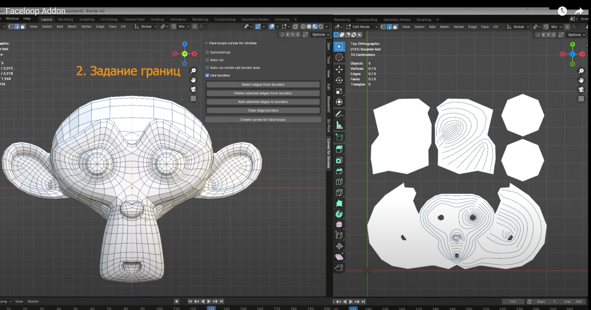
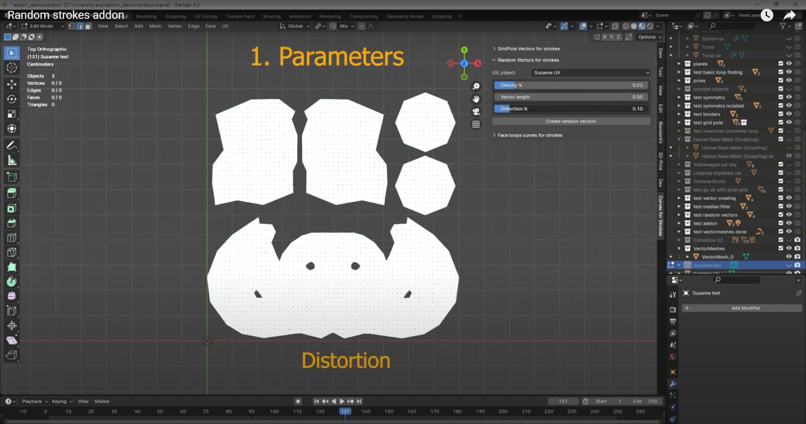

# Blender-аддон для создания штрихов краски на 3D моделях

## Описание аддона

Проект выполнен в качестве дипломной бакалаврской работы 2023-2024.

### Оригинальный инструмент для создания штрихов вручную

Данный аддон является развитием инструмента из данного видео (для перехода кликните на картинку). Оригинальный инструмент позволяет художнику рисовать на карте нормалей кривые, вдоль которых автоматически генерируются штрихи краски. Этот инструмент несколько ускоряет работу художника, позволяя рисовать штрихи группами и оставляя возможность их редактировать на любом этапе работы.

### Этот аддон - дополнение к тому инструменту

Данный аддон генерирует сами кривые по всей поверхности модели, оставляя художнику вносить отдельные правки. Аддон состоит из трех частей, каждая представляет разные подходы к генерации.

## Возможности

- Генерация штрихов по всей поверхности модели в трех режимах.
- Панель управления прямо в интерфейсе Blender.
- Возможность ручной коррекции для тонкой настройки результата.

Данной аддон реализован в виде трех панелей, в каждой из которых можно настроить параметры перед генерацией кривых.

## Примеры результатов

## Видео-демонстрация работы с инструментами
- Режим генерации кривых на основе топологии сетки модели (для перехода кликните на картинку)

- Режим генерацирии случайных штрихов (для перехода кликните на картинку)
- 

## Подробнее о каждом режиме генерации и алгоритмах, лежащих в основе генерации

Смотреть тут: [подробная инструкция](instruction.md)

## Установка
На данный момент инструмент не оформлен в стандартный вид аддона. Для использования инструмента в Blender необходимо скопировать код из папки dev_files, вставить его в панель скриптов и запустить как скрипт в Blender. После запуска кода в интерфейсе добавятся новые панели (в разделе, соответствующем аддонным панелям).

- Режим генерации на основе топологии сетки: face_loop.py
- Режим генерации с фильтром: face_loop_linear_comb.py
- Режим генерации случайных штрихов: random_vectors.py

Данный аддон создает кривые, но не создает штрихи (!).
Поэтому для работы со штрихами необходим инструмент из оригинального видео. Ссылка на него находится в описании под оригинальным видео.

Таким образом, этапы установки:
1. Скачать оригинальный инструмент из видео.
2. Открыть скачанный проект с инструментом, открыть панель скриптов.
3. Из этого репозитория в папке dev_files выбрать один из файлов с нужным вам режимом генерации (либо по очереди установить каждый).
4. Скопировать код из файла с нужным режимом, вставить его в панель скриптов в Blender, запустить код.
5. В разделе с аддонными панелями появится интерфейс из данного аддона.
6. (!) использовать кнопки на панелях нужно в режиме Edit mode.  

## Ограничения

1. См. ограничения по каждому из режимов генерации в подробной инструкции: [подробная инструкция](instruction.md)
2. Вдоль мест склейки карты нормалей штрихи обрезаются, это место нужно покрывать штрихами вручную

## Дальнейшее развитие проекта
Направления для улучшения инструмента:
- В режиме генерации на основе топологии перейти от кривых к отрезкам, как в остальных двух методах: грань <-> кривая с единственным штрихом
- Оформить в виде аддона, чтобы была возможность стандартной аддонной установки.
- Переписать поиск симметричных граней. На данный момент он основан на координатах и требует, чтобы origin модели был расположен в начале координат. Необходим метод, который ищет симметричные грани независимо от полежния модели в пространстве, а если модель несимметрична - уведомляет об этом.
  
Также необходимы существенные изменения инструмента для устранения следующих проблем:
- Между штрихами остаются пустые пространства, так как штрихи привязаны к сетке модели и создаются в центрах граней.
- Тот же эффект возникает из-за того, что все штрихи одного размера. Необходимо добавить автоматический подбор размера штриха в зависимости от размера грани, соответствующей штриху.
- Фильтры в режиме генерации с фильтром не работают. Необходимо реализовать фильтр, считающий углы между направляющими отрезками в пространстве регулярных сеток, а не в реальном пространстве.

В данный момент дальнейшее развитие не планируется.
