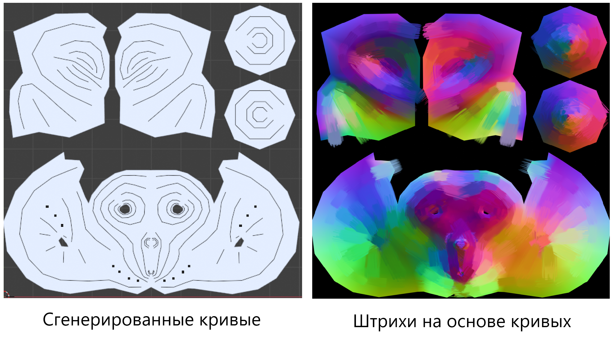
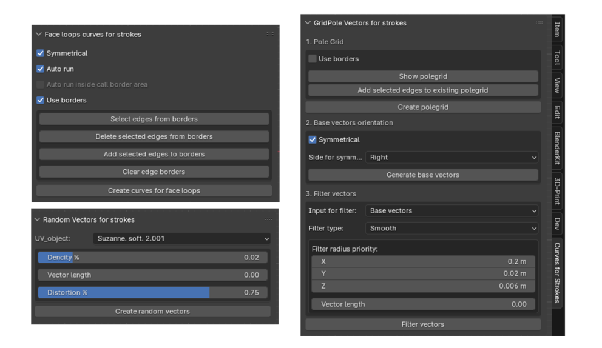
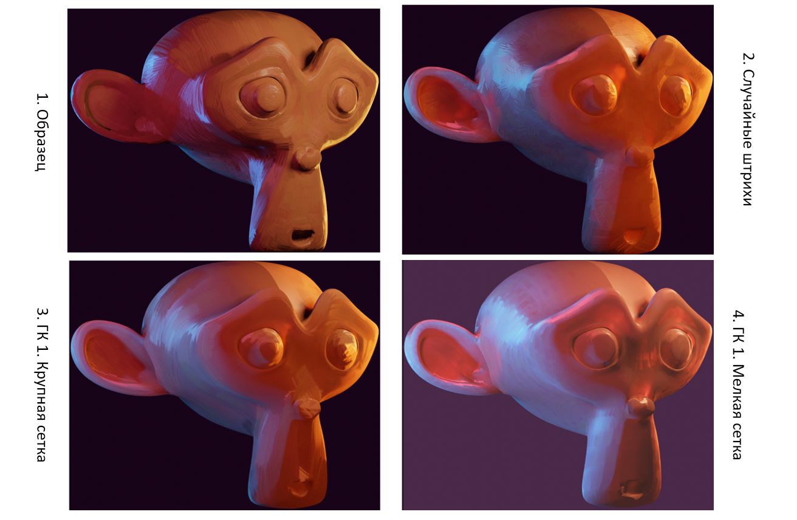
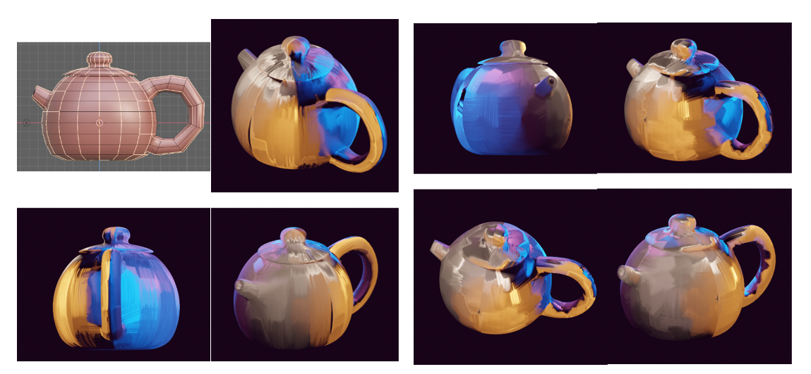

# Blender-аддон для создания штрихов краски на 3D моделях

## Описание аддона

Данный аддон является развитием инструмента из данного видео (для перехода кликните на картинку). Оригинальный инструмент позволяет художнику рисовать на карте нормалей кривые, вдоль которых автоматически генерируются штрихи краски. Этот инструмент несколько ускоряет работу художника, позволяя рисовать штрихи группами и оставляя возможность их редактировать на любом этапе работы.

Данный аддон генерирует сами кривые по всей поверхности модели, оставляя художнику вносить отдельные правки. Аддон состоит из трех частей, каждая представляет разные подходы к генерации.

## Возможности

- Генерация штрихов по всей поверхности модели в трех режимах.
- Панель управления прямо в интерфейсе Blender.
- Возможность ручной коррекции для тонкой настройки результата.

Данной аддон реализован в виде трех панелей, в каждой из которых можно настроить параметры перед генерацией кривых.

## Примеры результатов

## Демонстрация работы с инструментами
- Режим генерации кривых на основе топологии сетки модели

- Режим генерацирии случайных штрихов
- 
