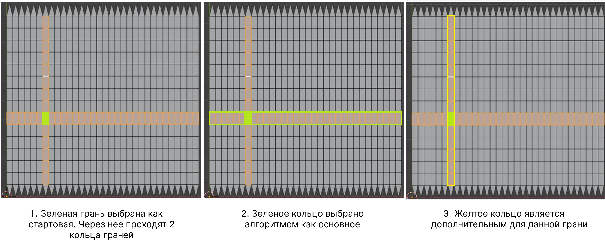
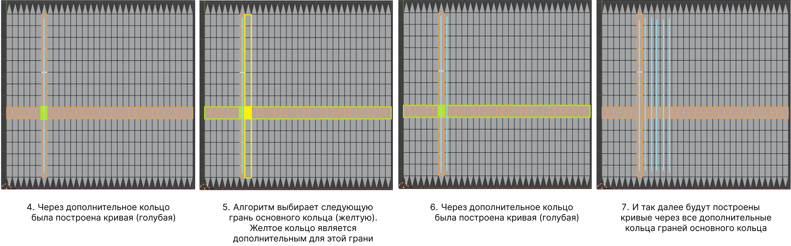
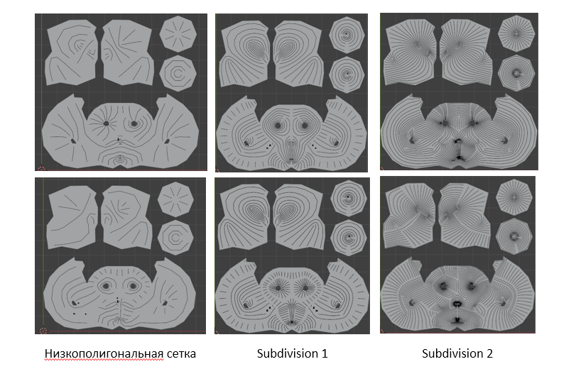
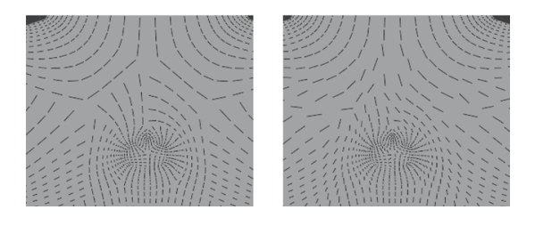
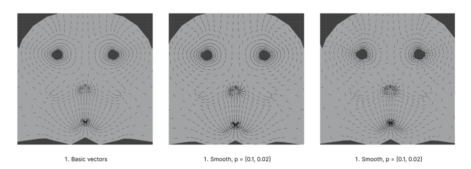
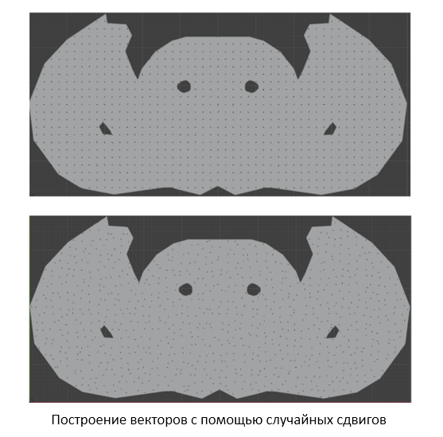

# Подробнее о каждом режиме генерации и алгоритмах, лежащих в основе генерации

## Режим генерации на основе топологии сетки
В данном режиме пользователь выбирает стартовую грань. Алгоритм найдет два кольца граней, проходящих через данную грань. Он выберет одно кольцо как основное. Алгоритм начнет проходить по каждой грани основного кольца. Через каждую такую грань основного кольца проходит второе кольцо граней, дополнительное. Именно вдоль дополнительных колец граней будут строиться кривые (см. картинки ниже).
Результат работы алгоритма зависит от того, какую стартовую грань выберет пользователь.

### *Базовый режим*
Выберите следующие опции в панели аддона:
- [ ] Symmetrical
- [ ] Auto run
- [ ] Auto run inside call border area
- [ ] Use borders

Этапы работы:
- В edit mode выбрать стартовую грань. Грань должна быть 4-угольная.
- Нажать на кнопку генерации. Алгоритм сгенерирует столько скривых, сколько сможет найти из выбранной стартовой точки. Все кривые появятся в списке объектов сцены.
- Если какая-то область с 4-угольными гранями осталась непокрыта кривыми, выбрать одну из таких граней в качестве стартовой и снова запустить генерацию.
- Если какие-то кривые вас не устраивают, удалите их, выбрав их в списке объектов сцены, и повторите генерацию. Выберите стартовую грань из числа непокрытых граней.

Важные ограничения:
- Алгоритм работает только с кольцами граней, которые существуют только для 4-угольных граней. Алгоритм не подойдет для обработки моделей, состоящих из треугольников или состоящих преимущественно не из 4-угольных граней.
- Кривые над не 4-угольными гранями необходимо нарисовать вручную (с помощью инструмента из оригинального видео)
- Алгоритм не подойдет для низкополигональных моделей, так как в этом случае кривые будут недостаточно густыми и между штрихами останутся большие расстояния. На картинке ниже видно, как изменяется густота кривых в зависимости от плотности сетки модели.

Видео с демонстрацией работы алгоритма: 

### *Дополнительно: симметричная разметка*

Если у вас симметричная модель (!) и вы хотите симметричную разметку кривыми, необходимовыберите расчертить моделть на две симметричных области, и только потом запускать алгоритм от стартовой грани.

Выберите следующие опции в панели аддона:
- [x] Symmetrical
- [ ] Auto run
- [ ] Auto run inside call border area
- [x] Use borders

- Выберите только те ребра, которые делят модель на две симметричные половины. Это граница для разметки.
- Нажмите в панели аддона "Add selected edges to borders".
Теперь алгоритм будет покрывать кривыми только ту область модели, в которой находится стартовая грань.
- Нажмите в панели аддона галочку у пункат "Symmetrical".
- Выберите стартовую грань и запустите алгоритм как обычно.

Алгоритм покроет кривыми область со стартовой гранью, а затем создаст симметричное покрытие для симметричной области.

- Если вы передумали и не хотите делать симметричную разметку, удалите разметку. Для этого нажмите "Clear edge borders".
- Также не забудьте убрать галочку у опции "Symmetrical" и "Use borders".

### *Дополнительно: произвольная разметка*
Выберите следующие опции в панели аддона:
- [ ] Symmetrical
- [ ] Auto run
- [ ] Auto run inside call border area
- [x] Use borders

Модель можно разметить не только на симметричные области, но и на произвольные. Алгоритм будет работать от стартовой грани только внутри области, которой принадлежит стартовая грань.
- Выберите ребра, которые вы хотите добавить в разметку.
- Нажмите в панели аддона "Add selected edges to borders".
- Чтобы посмотреть, какие ребра на данный момент входят в разметку, нажмите "Select edges from borders". Не забудьте сделать перед этим deselect чтобы выбранными оказались только ребра из разметки.
- Чтобы удалить какие-то ребра из разметки, выберите соответствующие ребра и нажмите "Delete selected edges from borders"
- Если вам больше не нужна разметка, удалите разметку. Для этого нажмите "Clear edge borders". Также не забудьте убрать галочку у опции "Use borders". Не убирайте эту опцию, если вы хотите просто удалить разметку и начать размечать заново с нуля.

Если при разметке вы создали симметричные области, в них можно сгенерировать симметричные кривые.
- Включите опцию "Symmetrical".
- Выберите стартовую грань в одной из симметричных областей и сгенерируйте кривые.
- Когда закончите работу над симметричными областями, уберите галочку у опции "Symmetrical".

### *Дополнительн: полное заполнение*

Если вы хотите, чтобы алгоритм покрыл кривыми всю модель (за исключением не 4-угольных граней) полностью без вашего участия:
- Включите опцию "Auto run".
- Выберите стартовую грань, запустите алгоритм.
- Алгоритм будет вызывать обходы, самостоятельно выбирая стартовые грани для всех последующих вызовов, пока не останется непокрытых граней.
- Алгоритм учтет разметку, если она есть и включена опция "Use borders"

Если вы хотите, чтобы алгоритм покрыл кривыми только размеченную область, из которой вы его вызываете:
- Включите опцию "Auto run inside call border area" и "Use borders".
- Выберите стартовую грань внутри желаемой области, запустите алгоритм.
- При этом выключите "Auto run", иначе алгоритм обойдет и стартовую область, и все другие непокрытые кривыми области.

! Поскольку стартовая грань выбирается случайно, в результате может получится множество областей, размеченных короткими кривыми со случайными направлениями.
В этом случае можно вручную удалить неудачные кривые, выключить автообход и начать вызывать обходы из выбранных вручную граней.

## Режим генерации кривых с фильтром
! Этот алгоритм основан на алгоритме из прошлого режима. Он требует понимание работы того алгоритма и понятия разметки из прошлого раздела.

Данный алгоритм позволяет автоматически разметить модель на области и автоматически заполнить их кривыми.
Такая генерация скорее всего создасть хаотичные кривые, часто меняющие направления и врезающиеся друг в друга на стыках.
Чтобы сгладить поток штрихов, в этом алгоритме применяется фильтрация штрихов, немного сглаживающая их направлени.

### *Базовый режим*
Выберите следующие опции в панели аддона:
- [ ] Use borders
- [ ] Symmetrical
- Vector lenght: 0.1
- Остальное - по умолчанию

Этапы работы:
1. Создайте авто-разметку (polegrid), нажав на кнопку "Create polegrid".
2. Сгенерируйте полное покрытие модели базовыми кривыми (отрезками), нажав на кнопку "Generate base vectors".
3. Сгладьте векторы с помощью фильтра, нажав на "Filter vectors".
4. Если векторы сгладились недостаточно, повторите сглаживание. Для этого выбирите в пункте Input установите вместо "Base vectors" опцию "Previous vectors". Также можете изменить настройки фильтра (тип фильтра, радиусы). Нажмите "Filter vectors" для применения фильтра.
5. Повторяйте 4-ый шаг, сколько нужно.
6. Если вы хотите снова вернуться к базовым векторам и начать фильтрацию заново с нуля, не нужно генерировать базовые векторы еще раз. Просто выберите в пункет Input опцию "Base vectors". Примините фильтр с нужными настройками.

### *Настройки фильтра*

! Данный раздел не прописан, так как на данный момент фильтр работает неудовлетворительно. Результат непредсказуем, направления векторов могут не сгладиться, а, наоборот, стать хаотичнее, вопреки настройкам. Требуется написание реализации других фильтров.

## Режим генерации случайных штрихов

Данный алгоритм располагает штрихи равномерно на одинаковом расстоянии друг от друга и с одинаковым направлением, независимо от топологии сетки модели.
Затем штрихи случайным образом сдвигаются в стороны на небольшое отклонение.

Выберите следующие опции в панели аддона:
- UV_object: объект, который вы покрываете штрихами, развернутый в сетку на плоскости в начале координат.
- Dencity: плотность штрихов (расстояние между ними), по умолчанию
- Vector lenght: 0.1, по умолчанию
- Distortion: отклонение штрихов от начальных положений, по умолчанию

  Этапы работы:
  - Создайте копию вашей модели и разверните ее в UV-сетку (см. гео-ноды из оригинального видео, производящие развертку)
  - Задайте плотность и отклонение для штрихов. Сначала попробуйте по умолчанию, а затем меняйте и подбирайте опытным путем.
  - Нажмите "Create random vectors".
  - Если плотность или отклонение не подошли, выберите другие значения для этих параметров и снова сгенерируйте векторы.

Видео с демонстрацией работы алгоритма: 

